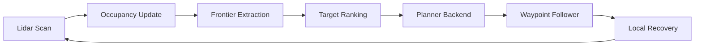

# RoboAI

RoboAI - Autonomous Exploration and Path Planning Benchmark Platform

Built a deterministic 2D robotics benchmark for occupancy-grid mapping, frontier-based exploration, and collision-aware path planning. The platform simulates lidar sensing, updates an exploration map online, plans routes to frontiers using A*, RRT, and RRT*, and exports replayable demos plus benchmarking metrics across indoor maps.


## Overview

RoboAI focuses on the core autonomy loop instead of simulator integration overhead: lidar sensing, online occupancy mapping, frontier extraction, target ranking, planner selection, waypoint following, local recovery, and benchmark reporting. The current system ships with five built-in 2D indoor maps and three planner backends, plus reproducible demo and batch benchmarking entrypoints.

## System Architecture



## Methods

### Occupancy Mapping

The simulator performs deterministic 2D ray casting and updates a discrete occupancy grid online. Unknown cells become free along traversed beams, and occupied hits are sticky once observed so wall evidence remains stable for the rest of the run.

### Frontier Selection

Frontiers are defined as free cells adjacent to unknown cells. Frontier regions are grouped by connected components, ranked by distance, heading consistency, and region size, and filtered by blocked-target history so the robot does not keep retrying the same failed frontier.

### Planner Backends

`astar` is the reference planner for grid-based collision-aware routing. `rrt` and `rrt_star` provide sampling-based alternatives for the same benchmark interface. The batch benchmark compares all three against identical maps and seeds.

### Waypoint Follower / Local Recovery

Planned paths are followed with a lightweight waypoint controller. The controller rotates in place when heading error is large, applies a forward-arc emergency stop, replans on collision, and runs a short recovery rotation when coverage stagnates.

## Benchmark Protocol

Official benchmark suite:

```bash
python -m roboai.app.run_batch \
  --maps empty office cluttered narrow maze \
  --planners astar rrt rrt_star \
  --seeds 1 7 13 \
  --write-run-artifacts
```

`run_batch` reuses the map-specific defaults from `run_demo`, so `empty`, `office`, `cluttered`, `narrow`, and `maze` each use their own default coverage targets and step budgets unless explicitly overridden.

Primary outputs:

- per-run metrics: [`reports/batch_metrics.csv`](reports/batch_metrics.csv)
- aggregated summary: [`reports/batch_summary.md`](reports/batch_summary.md)
- success plot: [`reports/success_rate_by_planner.png`](reports/success_rate_by_planner.png)
- coverage plot: [`reports/coverage_vs_time.png`](reports/coverage_vs_time.png)
- runtime plot: [`reports/runtime_by_planner.png`](reports/runtime_by_planner.png)

## Results

Example generated artifacts:

- final map: 
- benchmark coverage plot: 

Planner comparison from the current benchmark summary:

| planner | success rate | mean coverage | mean path length | mean runtime (s) | mean collisions | mean replans |
| --- | --- | --- | --- | --- | --- | --- |
| astar | 1.000 | 0.652 | 13.77 | 5.15 | 0.60 | 4.20 |
| rrt | 0.933 | 0.653 | 15.87 | 6.98 | 0.07 | 6.47 |
| rrt_star | 0.933 | 0.654 | 14.16 | 24.29 | 0.80 | 6.07 |

Representative per-map demo outcomes with the current defaults:

| map | planner | success | coverage | path length | collisions | replans |
| --- | --- | --- | --- | --- | --- | --- |
| empty | astar | true | 0.802 | 5.76 | 0 | 2 |
| office | astar | true | 0.654 | 11.93 | 0 | 3 |
| cluttered | astar | true | 0.754 | 14.67 | 2 | 5 |
| narrow | astar | true | 0.601 | 14.29 | 1 | 4 |
| maze | astar | true | 0.451 | 22.17 | 0 | 7 |

## Failure Modes

- Long corridor and maze runs can still spend too much time on frontier retries before switching targets.
- `rrt_star` remains the most expensive backend and can dominate benchmark runtime.
- Sampling planners are more sensitive to narrow passages and frontier placement than `astar`.
- Recovery is heuristic; it is effective for local stagnation, but it is not a formal hybrid planning policy yet.

## Known Limitations

- assumes perfect localization
- uses 2D binary obstacle maps
- does not model wheel slip
- simulated lidar is idealized
- planner runtime is CPU-only and single-threaded

## Future Work

- add path smoothing and report raw vs smoothed path quality
- evaluate naive vs information-gain frontier ranking
- add dynamic obstacle and disturbance experiments
- add sensor and localization noise for robustness studies
- formalize hybrid planner fallback policies
- add config profiles, lint/type tooling, and a lightweight benchmark report workflow

## Quick Start

```bash
pip install -e .
python -m roboai.app.run_demo --map office --planner astar --seed 7
```
