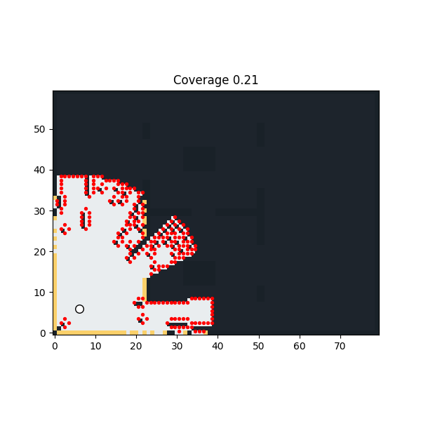

# RoboAI

RoboAI is a benchmark-first autonomous exploration platform with an early ROS2 deployment prototype validated in TurtleBot3 simulation.

The primary implementation lives in the Python benchmark runtime under `src/roboai`, where occupancy mapping, frontier ranking, planner backends, metrics, demos, and ablations are most complete. The ROS2 workspace under `roboai_ros2_ws/` is a deployment prototype: it validates topic integration and closed-loop motion in simulation, but it does not yet have full feature parity with the benchmark runtime.



## Repo Status

- `src/roboai/`: primary benchmark implementation and evaluation runtime
- `roboai_ros2_ws/`: early ROS2 deployment prototype for TurtleBot3 Gazebo on ROS2 Humble
- `reports/`: generated benchmark metrics, plots, and ablation summaries
- `demo/`: replayable GIF and MP4 demos

## Architecture

```text
Python Benchmark Core
  occupancy mapping
  frontier scoring
  planner backends
  waypoint following
  metrics / ablations

ROS2 Prototype
  /scan -> mapping_node -> /map
  /map + /odom -> frontier_node -> /goal
  /map + /goal + /odom -> planning_node -> /path
  /path + /odom -> control_node -> /cmd_vel
```

## Benchmark Runtime

Implemented now:

- deterministic 2D occupancy-grid mapping with simulated lidar
- frontier policies: `naive`, `information_gain`, `semantic_information_gain`, `learned_linear`
- planner backends: `astar`, `rrt`, `rrt_star`, `hybrid`
- disturbance and noise experiments
- ablation runner and exported comparison plots
- cooperative two-robot benchmark prototype

Benchmarked now:

- planner comparison across five indoor maps
- frontier-policy ablations
- disturbance/noise runs
- single-robot vs two-robot time-to-coverage

Quick start:

```bash
pip install -e .
python -m roboai.app.run_demo --map office --planner astar --seed 7
python -m roboai.app.run_ablations
```

Primary artifacts:

- [`reports/batch_summary.md`](reports/batch_summary.md)
- [`reports/ablation_summary.md`](reports/ablation_summary.md)
- [`reports/ablation_policy_coverage.png`](reports/ablation_policy_coverage.png)
- [`reports/ablation_robot_time_to_coverage.png`](reports/ablation_robot_time_to_coverage.png)

## ROS2 Prototype

What is implemented:

- `/scan` input
- `/odom` input
- `/map` publication
- `/goal` publication
- `/path` publication
- `/cmd_vel` publication
- TurtleBot3 closed-loop validation path in Gazebo

What is not implemented yet:

- full parity with benchmark frontier scoring and semantic policies
- full parity with all planner backends and ablations
- learned frontier model integration in ROS2
- multi-robot ROS2 deployment
- polished RViz marker/debug tooling

The ROS2 workspace is a deployment prototype, not the primary research runtime. It is strongest as a systems validation path for the core RoboAI stack, not as the main benchmark environment.

See [`roboai_ros2_ws/README.md`](roboai_ros2_ws/README.md) for ROS2 setup and launch commands.

## Results And Validation

Benchmark runtime:

- benchmarked across five indoor maps with A*, RRT, and RRT*
- exports replayable demos, JSON/CSV metrics, and ablation plots
- supports noise/disturbance studies and frontier-policy comparisons

ROS2 prototype:

- validated with live `/scan`, `/odom`, and `/cmd_vel` flow in TurtleBot3 simulation
- supports closed-loop sensing, goal selection, path publication, and actuation
- currently simpler than the Python benchmark runtime, but now wired around the same core occupancy/frontier/planning/control modules

## Honest Limits

- uncertainty handling is a lightweight penalty term, not full SLAM or belief-space planning
- learned frontier scoring is a trainable linear model, not a deep policy network
- ROS2 support is a deployment prototype, not full benchmark parity
- cooperative exploration in the benchmark runtime is still heuristic and overlap-heavy

## Docs

- [`docs/architecture.md`](docs/architecture.md)
- [`docs/benchmark.md`](docs/benchmark.md)
- [`docs/ros2.md`](docs/ros2.md)
