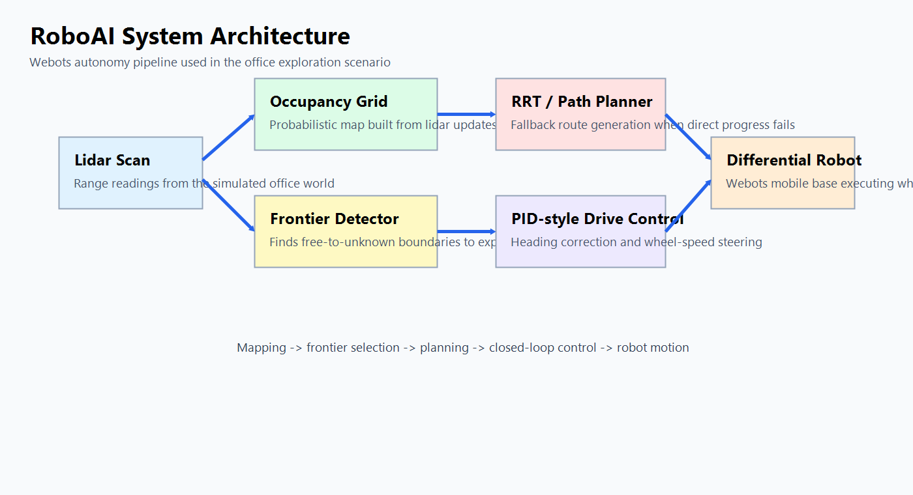
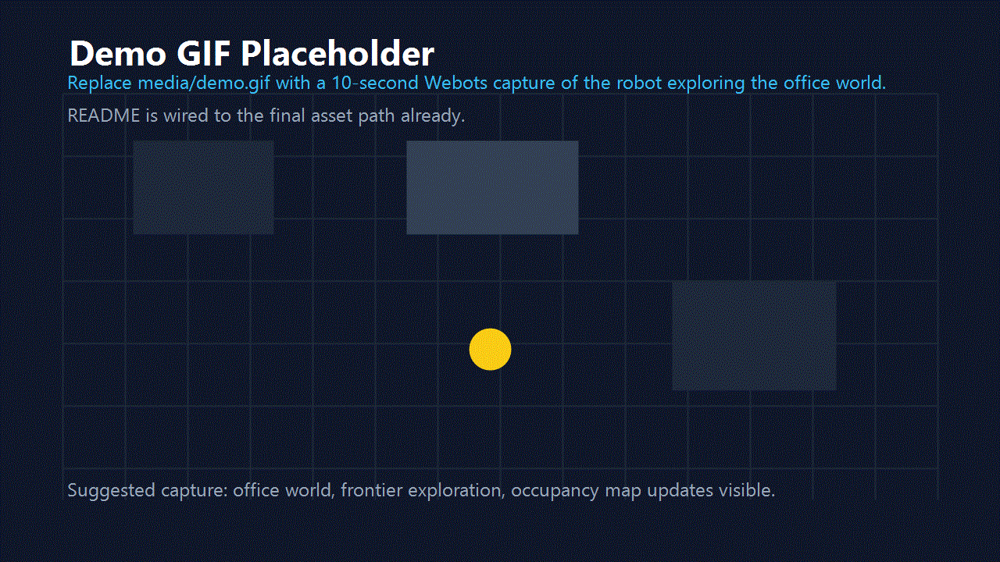

# RoboAI

RoboAI is a Webots-based autonomous robot system implementing frontier exploration, obstacle avoidance, and path planning in simulated indoor environments.

## Overview

RoboAI runs a differential-drive robot in Webots and combines lidar mapping, frontier detection, closed-loop navigation, and autonomous exploration in office-style worlds. The system builds an occupancy grid online, selects frontier targets, plans collision-aware routes, and drives the robot through the environment while logging artifacts for evaluation.

## Features

- frontier-based exploration
- grid-based path planning fallback
- lidar-based obstacle detection
- PID-style differential drive control
- occupancy grid mapping

## System Architecture



Core autonomy flow:

```text
Lidar -> Occupancy Grid
      -> Frontier Detector
      -> Path Planner
      -> PID Controller
      -> Differential Drive Robot
```

Main runtime components:

- `webots_project/controllers/roboai_controller/occupancy_grid.py`: builds and updates the occupancy grid from lidar scans.
- `webots_project/controllers/roboai_controller/frontier.py`: finds free-to-unknown frontier cells for exploration.
- `webots_project/controllers/roboai_controller/path_planner.py`: computes collision-aware waypoint paths over the occupancy grid.
- `webots_project/controllers/roboai_controller/executor.py`: handles exploration, local avoidance, heading correction, and waypoint tracking.
- `webots_project/controllers/roboai_controller/roboai_controller.py`: main Webots controller loop and artifact export.

## Demo



`media/demo.gif` is wired into the README and currently acts as a placeholder asset. Replace it with a 10-second Webots capture of the robot exploring `world_office.wbt`.

## Project Structure

```text
.github/workflows/                 GitHub Actions CI
webots_project/
  controllers/roboai_controller/   Main autonomy stack
  controllers/roboai_supervisor/   Evaluation supervisor
  config/goals/                    Named waypoint goals per world
  worlds/                          Webots environments
demo/                              Demo command presets
scripts/                           Evaluation and reporting utilities
tests/                             Unit tests for planning and perception
reports/                           Generated maps, plots, and summaries
media/                             README assets
```

Key worlds:

- `webots_project/worlds/world_office.wbt`
- `webots_project/worlds/world_obstacles.wbt`
- `webots_project/worlds/world_empty.wbt`

## How to Run

1. Install dependencies:

```bash
pip install -r requirements.txt
```

2. Open a Webots world such as `webots_project/worlds/world_office.wbt`.

3. Select the exploration demo:

```bash
python scripts/select_demo.py --demo demo2
```

4. Start the simulation in Webots.

Useful follow-up reports:

```bash
python scripts/log_summary.py
python scripts/evaluate_mvp.py
python scripts/evaluate_world_batch.py
```

Generated artifacts include occupancy maps, run summaries, and JSON logs under `reports/` and `data/logs/`.

## Benchmark Numbers

The batch-evaluation table is generated from saved run logs, not hardcoded values. To produce real numbers for the office, obstacles, and empty worlds:

1. Run multiple trials in Webots and keep the generated `data/logs/run_*.json` files.
2. Make sure each run records the correct `world_name` in its `plan_built` event.
3. Aggregate the logs:

```bash
python scripts/evaluate_world_batch.py --log-dir data/logs
```

4. Read the resulting summaries in `reports/world_batch_eval.md` and `reports/world_batch_eval.json`.

For the MVP benchmark summary, run:

```bash
python scripts/evaluate_mvp.py --log-dir data/logs
```

## Testing And CI

Automated tests cover planner behavior, frontier extraction, perception helpers, controller execution edge cases, and evaluation aggregation. GitHub Actions runs the suite on every push and pull request using `.github/workflows/ci.yml`.
