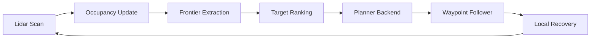
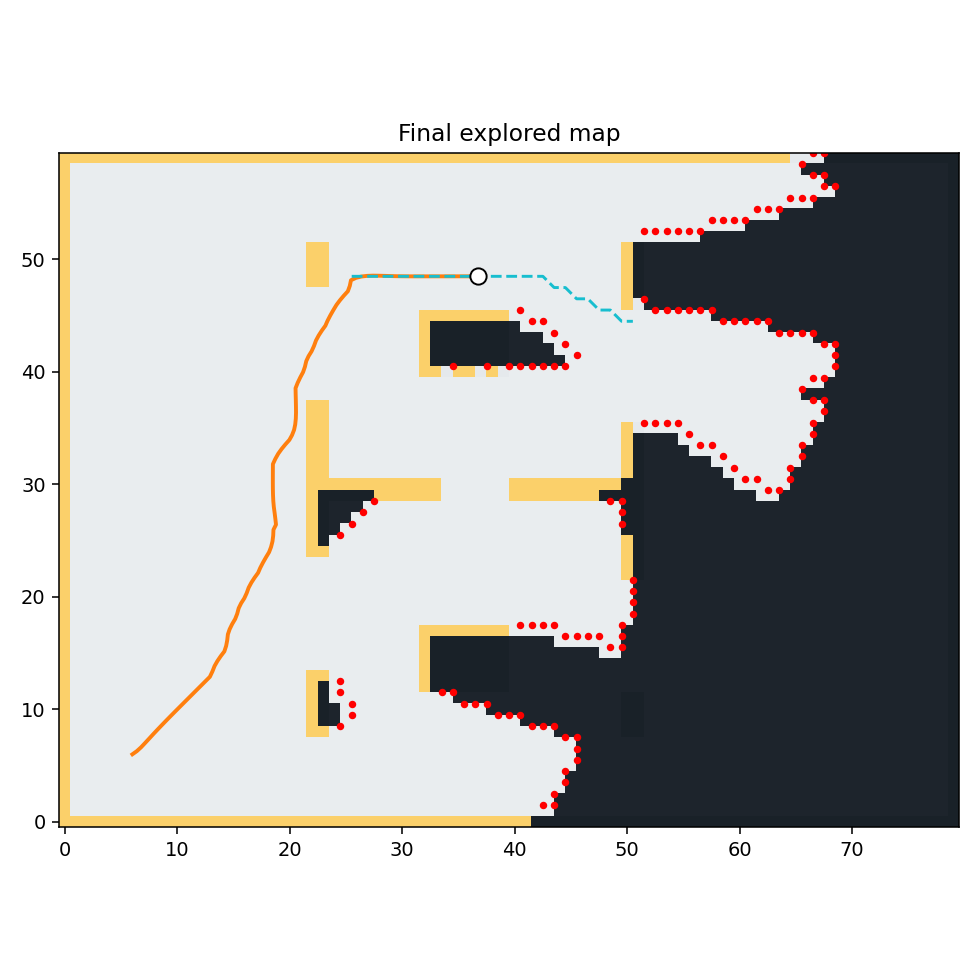
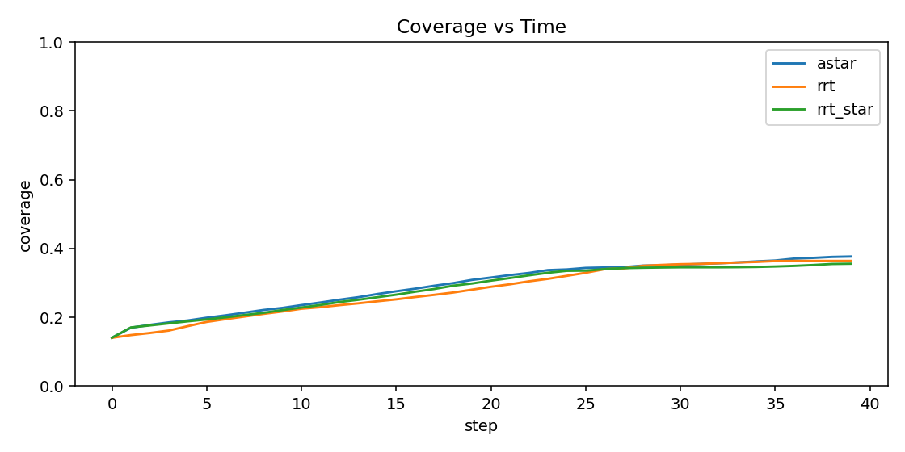

# RoboAI

RoboAI - Autonomous Exploration and Path Planning Benchmark Platform

Built a deterministic 2D robotics benchmark for occupancy-grid mapping, frontier-based exploration, collision-aware path planning, semantic target weighting, and disturbance/noise robustness studies. The platform simulates lidar sensing, updates an exploration map online, plans routes to frontiers using A*, RRT, and RRT*, and exports replayable demos plus benchmarking metrics across indoor maps.


## Overview

RoboAI focuses on the core autonomy loop instead of simulator integration overhead: lidar sensing, online occupancy mapping, frontier extraction, target ranking, planner selection, waypoint following, local recovery, and benchmark reporting. The current system ships with five built-in 2D indoor maps, semantic overlays, uncertainty-penalized frontier scoring, a trainable linear frontier scorer, a cooperative two-robot prototype, and a ROS-style topic wrapper scaffold around the same runtime.

## Scope Status

### Implemented Now

- deterministic 2D occupancy-grid mapping with simulated lidar
- frontier policies: `naive`, `information_gain`, `semantic_information_gain`, `learned_linear`
- planner policies: `astar`, `rrt`, `rrt_star`, and `hybrid` (`A* -> RRT` fallback)
- disturbance and noise experiments
- GIF and MP4 artifact export
- two-robot shared-map prototype

### Benchmarked Now

- frontier policy comparisons
- planner comparison under nominal runs
- hybrid planner behavior under temporary corridor blocking
- noisy sensing and pose-drift runs with semantics enabled/disabled
- single-robot vs two-robot time-to-coverage

### Prototype / Scaffold

- ROS-style topic/node wrapper in-process
- trainable linear frontier scorer driven by explicit frontier features
- two-robot coordination with shared map, target separation, and simple deconfliction

### Future Work

- real ROS2 `rclpy` integration and launch files
- richer semantic perception instead of static map annotations
- rollout-trained frontier scoring instead of synthetic supervision
- stronger multi-robot task allocation and reservation logic

## System Architecture



## Methods

### Occupancy Mapping

The simulator performs deterministic 2D ray casting and updates a discrete occupancy grid online. Unknown cells become free along traversed beams, and occupied hits are sticky once observed so wall evidence remains stable for the rest of the run.

### Frontier Selection

Frontiers are defined as free cells adjacent to unknown cells. Frontier regions are grouped by connected components, then ranked with `naive`, `information_gain`, `semantic_information_gain`, and `learned_linear` policies. The higher-level policies combine path cost, heading consistency, expected unknown reveal, semantic map value, blocked-target penalties, revisit penalties, and a lightweight localization-uncertainty penalty. This is uncertainty-aware target ranking, not full SLAM or belief-space planning.

### Planner Backends

`astar` is the reference planner for grid-based collision-aware routing. `rrt` and `rrt_star` provide sampling-based alternatives for the same benchmark interface. The batch benchmark compares all three against identical maps and seeds.

### Waypoint Follower / Local Recovery

Planned paths are followed with a lightweight waypoint controller. The controller rotates in place when heading error is large, applies a forward-arc emergency stop, replans on collision, and runs a short recovery rotation when coverage stagnates.

### High-Level Extensions

- semantic exploration: maps include lightweight `door`, `desk`, `exit`, `person`, and `beacon` annotations
- trainable linear frontier scorer: `python -m roboai.app.train_frontier_model --out reports/frontier_model_weights.json`
- uncertainty-aware exploration: frontier utility is penalized by accumulated localization uncertainty and partially reduced near beacon zones
- cooperative two-robot prototype: `python -m roboai.app.run_multi_demo --map office --planner hybrid`
- ROS-style wrapper scaffold: `python -m roboai.app.run_ros2_demo --map office --planner hybrid`

## Benchmark Protocol

Official benchmark suite:

```bash
python -m roboai.app.run_batch \
  --maps empty office cluttered narrow maze \
  --planners astar rrt rrt_star hybrid \
  --frontier-policies information_gain semantic_information_gain learned_linear \
  --seeds 1 7 13 \
  --frontier-model reports/frontier_model_weights.json \
  --write-run-artifacts
```

`run_batch` reuses the map-specific defaults from `run_demo`, so `empty`, `office`, `cluttered`, `narrow`, and `maze` each use their own default coverage targets and step budgets unless explicitly overridden. Train the lightweight frontier model before benchmarking `learned_linear`:

```bash
python -m roboai.app.train_frontier_model --out reports/frontier_model_weights.json
```

Primary outputs:

- per-run metrics: [`reports/batch_metrics.csv`](reports/batch_metrics.csv)
- aggregated summary: [`reports/batch_summary.md`](reports/batch_summary.md)
- success plot: [`reports/success_rate_by_planner.png`](reports/success_rate_by_planner.png)
- coverage plot: [`reports/coverage_vs_time.png`](reports/coverage_vs_time.png)
- runtime plot: [`reports/runtime_by_planner.png`](reports/runtime_by_planner.png)
- learned weights: [`reports/frontier_model_weights.json`](reports/frontier_model_weights.json)

Ablation runner:

```bash
python -m roboai.app.run_ablations
```

This writes:

- [`reports/ablation_summary.md`](reports/ablation_summary.md)
- [`reports/ablation_policy_coverage.png`](reports/ablation_policy_coverage.png)
- [`reports/ablation_robot_time_to_coverage.png`](reports/ablation_robot_time_to_coverage.png)

## Results

Example generated artifacts:

- final map: 
- benchmark coverage plot: 

Planner comparison from the current benchmark summary:

| planner | success rate | mean coverage | mean path length | mean runtime (s) | mean collisions | mean replans |
| --- | --- | --- | --- | --- | --- | --- |
| astar | 1.000 | 0.652 | 13.77 | 5.15 | 0.60 | 4.20 |
| rrt | 0.933 | 0.653 | 15.87 | 6.98 | 0.07 | 6.47 |
| rrt_star | 0.933 | 0.654 | 14.16 | 24.29 | 0.80 | 6.07 |

Representative per-map demo outcomes with the current defaults:

| map | planner | success | coverage | path length | collisions | replans |
| --- | --- | --- | --- | --- | --- | --- |
| empty | astar | true | 0.802 | 5.76 | 0 | 2 |
| office | astar | true | 0.654 | 11.93 | 0 | 3 |
| cluttered | astar | true | 0.754 | 14.67 | 2 | 5 |
| narrow | astar | true | 0.601 | 14.29 | 1 | 4 |
| maze | astar | true | 0.451 | 22.17 | 0 | 7 |

## Evaluation Questions

- Does smarter frontier scoring improve coverage and utility over `naive`?
- Does `hybrid` planning recover better than `astar` under corridor blocking?
- Does semantics help under noisy sensing and pose drift?
- Does two-robot exploration reduce time-to-coverage compared with one robot?

The repo now ships an explicit ablation runner for those questions instead of only a broad planner sweep.

## Failure Modes

- Long corridor and maze runs can still spend too much time on frontier retries before switching targets.
- `rrt_star` remains the most expensive backend and can dominate benchmark runtime.
- Sampling planners are more sensitive to narrow passages and frontier placement than `astar`.
- The ROS-style wrapper is an in-process topic graph scaffold; it is not a real ROS2 dependency.
- The trainable frontier scorer is a linear model over explicit frontier features; it is not a deep learned navigation policy.
- The cooperative two-robot mode uses shared-map target separation and simple spacing heuristics, not full task allocation or reservation planning.

## Known Limitations

- assumes perfect localization
- uses 2D binary obstacle maps
- does not model wheel slip
- simulated lidar is idealized
- planner runtime is CPU-only and single-threaded
- uncertainty is modeled as a lightweight penalty term, not a full localization or SLAM back-end

## Future Work

- replace the ROS-style topic wrapper with a real `rclpy` package and launch files when ROS2 is available
- add richer semantic detectors instead of static map annotations
- train the frontier model from rollout data instead of synthetic supervision
- extend cooperative exploration from two robots to explicit task-allocation and overlap-reduction studies
- add config profiles, lint/type tooling, and a lightweight benchmark report workflow

## Quick Start

```bash
pip install -e .
python -m roboai.app.run_demo --map office --planner astar --seed 7
python -m roboai.app.train_frontier_model --out reports/frontier_model_weights.json
python -m roboai.app.run_multi_demo --map office --planner hybrid --seed 7
python -m roboai.app.run_ros2_demo --map office --planner hybrid --seed 7
```

For the ROS2 migration scaffold, see [`roboai_ros2_ws/README.md`](roboai_ros2_ws/README.md).
