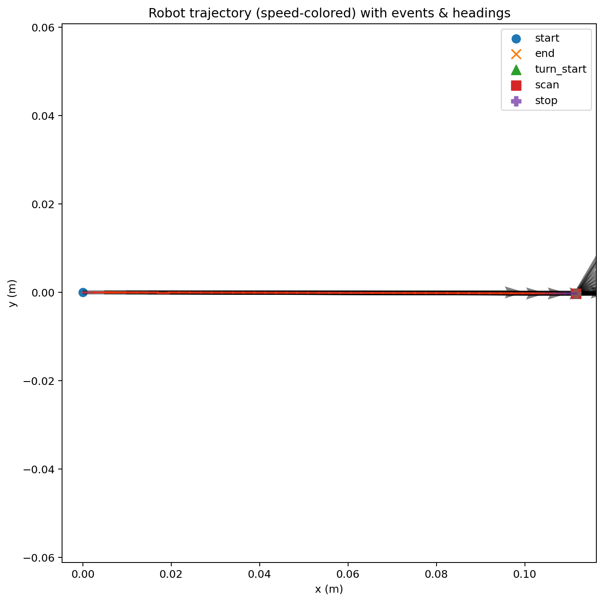

# Run analysis — run_20251005_205040.json

Over 4.3 s, the robot traveled 0.11 m at an average speed of 0.03 m/s. It executed ~1 turn(s) (total heading change ≈ 61°). Peak front obstacle level observed was 0.02 (normalized). Trajectory: (0.00, 0.00) → (0.11, -0.00). Noticed: heading oscillation.

## Key metrics
- Distance: **0.11 m**
- Duration: **4.3 s**
- Avg speed: **0.03 m/s**
- Turns: **1**  (total Δθ ≈ **61°**)
- Wait time: **0.0 s**
- Max front obstacle level: **0.02**
- Anomalies: **heading oscillation**